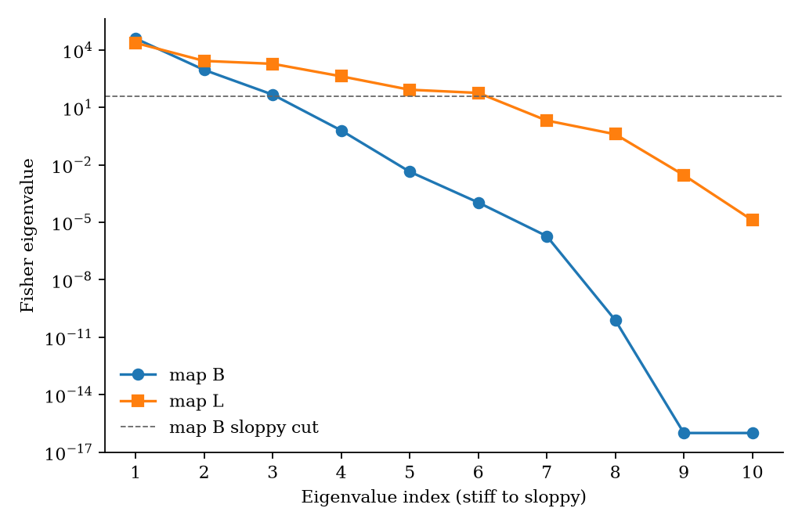
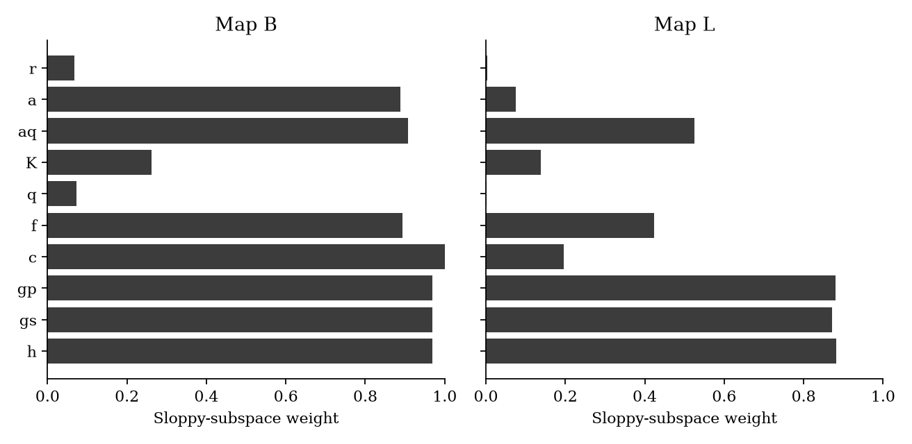
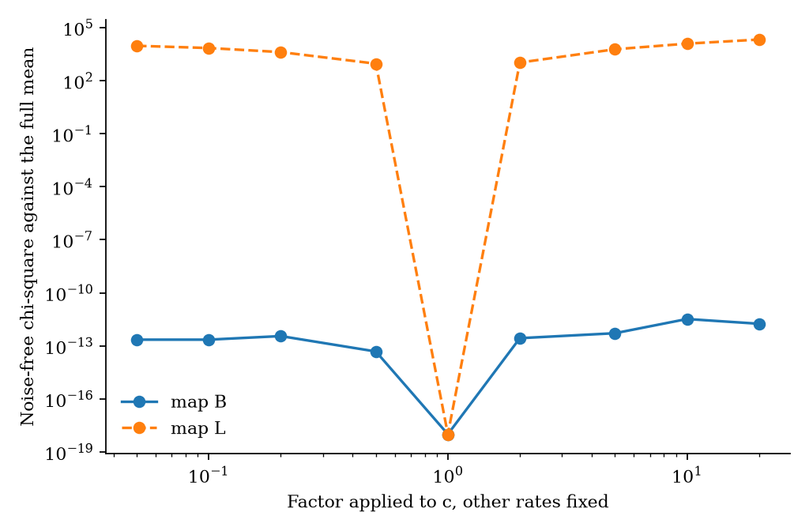
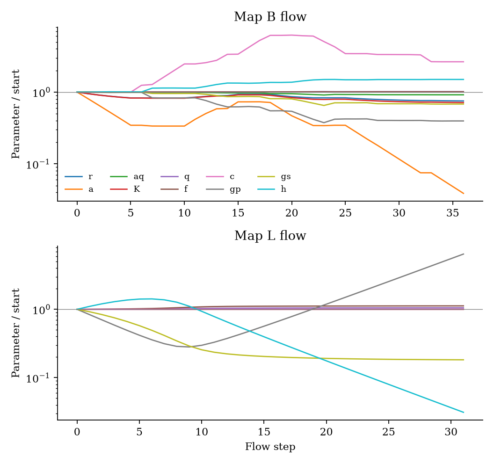
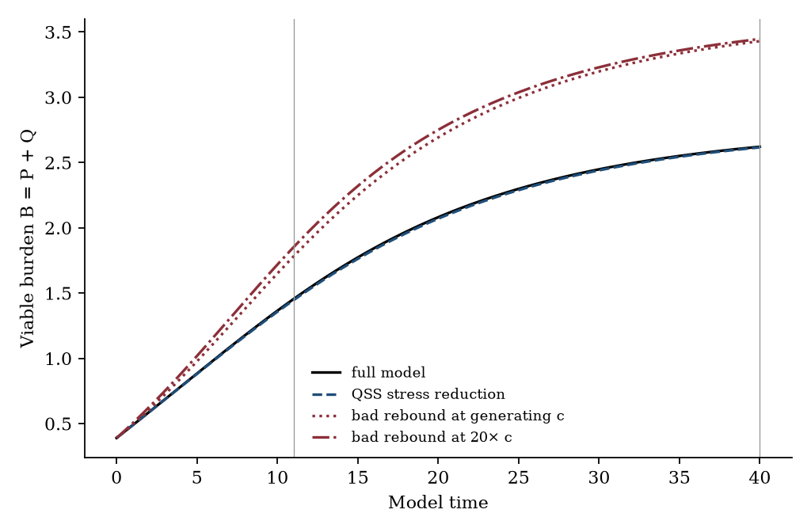
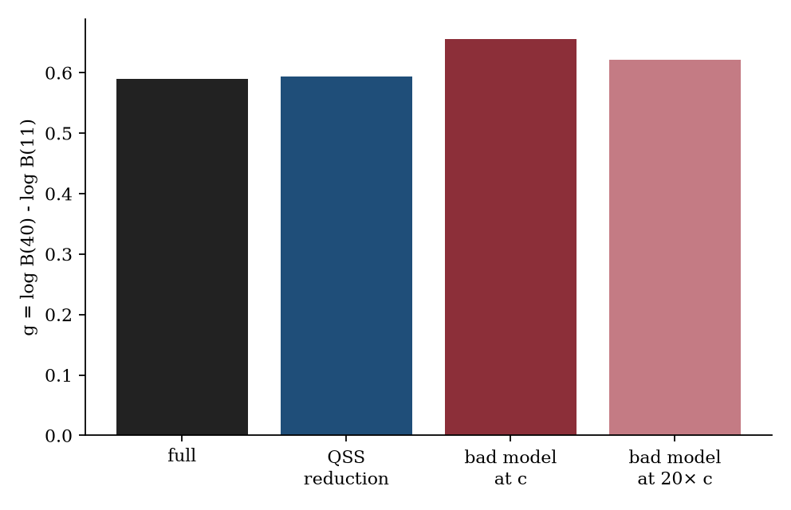

# Stiff-sloppy spectra and systematic reduction of high-dimensional cancer-state ODEs under gated observation maps

**Thesis #12. Computational research thesis** (series label NP-04)  
**Author:** Kelechi Emeka Ogbonna  
**Correspondence:** kelechiogbonna300@gmail.com · https://github.com/cloudynirvana/thesis-12-stiff-sloppy-cancer-ode-reduction  
**Date:** 21 September 2026  
**Format:** B.Sc. project chapters (Nile University style), written as a computational methods manuscript  
**Status:** In-silico sloppiness and reduction on a declared toy. Not a cell-line fit. Not a clinical result.  
**Citation style:** numbered Vancouver. A `doi:` field appears only where Crossref returned the record.  
**DOI:** none for this document. Do not invent one.

---

## Title page

**STIFF-SLOPPY SPECTRA AND SYSTEMATIC REDUCTION OF HIGH-DIMENSIONAL CANCER-STATE ODES UNDER GATED OBSERVATION MAPS**

BY

**KELECHI EMEKA OGBONNA**

A COMPUTATIONAL RESEARCH THESIS  
(IN-SILICO SLOPPINESS AND MODEL-REDUCTION STUDY)

SUBMITTED AS A CITEABLE MANUSCRIPT FOR JOURNAL / THESIS HANDOFF

PROJECT CONFLUENCE  
INDEPENDENT COMPUTATIONAL RESEARCH

SUPERVISOR: not appointed for this deposit

SEPTEMBER 2026

---

## Declaration

I, Kelechi Emeka Ogbonna, declare that this computational research thesis was carried out by me. The spectra, flows and reduced trajectories reported here were produced by `sim/sloppy_reduction.py` at seed 20260921. They are not wet-lab measurements and not patient outcomes. No DOI, ORCID or journal acceptance was invented for this document.

_________________________     _______________________  
Kelechi Emeka Ogbonna         Date

---

## Abstract

Which directions of a high-dimensional cancer-state parameter space are sloppy under realistic observation maps, and can a documented MBAM / Fisher-geometry reduction preserve the gated claims of the full model without silently renaming leftover sloppy combinations as biology? The calculations use a four-state toy with ten positive rates. The states are proliferating cells, quiescent cells, an apoptotic compartment, and a stress variable that neither map records. Map B records log viable burden at eight times. Map L records log proliferating cells, log quiescent cells, and log apoptotic cells at the same times.

The gated claim is g = log B(40) - log B(11), with B the viable burden. Its log-parameter gradient lies in the stiff subspace of both maps: the sloppy fraction of that gradient's squared length is 2.80×10−6 on map B and 6.15×10−4 on map L. At the generating rates, g = 0.5895.

Map B has numerical Fisher rank 5 of 10 and practical rank 3 of 10, using cuts of 10−8 and 10−3 times the leading eigenvalue. Apoptotic clearance is an exact null coordinate on that map. Map L has numerical rank 9 of 10 and practical rank 6 of 10. Clearance is then visible. The two trailing eigenvectors of map L change log kappa = log h + log gp - log gs by only -0.057 and +0.0095, so the stiff stress object is the product kappa = h gp / gs.

A quasi-steady reduction that keeps kappa, and slaves stress to burden, reproduces g with relative error 0.0070. The root-mean-square discrepancy in the log observations is 0.0042 on map B and 0.0059 on map L. An eigenvector flow on map B moves the proliferating-cell apoptosis rate to 0.0388 times its generating value. The noise-free chi-square on map B at that point is 4.34×10−7, and g changes by 9.0×10−6. The same apoptosis factor, with every other rate frozen, produces chi-square 2385. A sentence that reads the flowed coordinate as a death-resistant phenotype renames one entry of a sloppy combination. Inserting clearance into the proliferating equation as a rebound drive moves g from 0.5895 to 0.6558 and yields chi-square 543 on map B, a map that cannot see clearance at all.

The generator is synthetic. Seed 20260921. Research only. Not a medical device, not a dose, and not a cure.

---

## Keywords

sloppiness; Fisher information; manifold boundary approximation; model reduction; cancer ordinary differential equations; observation map; parameter combination; synthetic generator; research only

---

## Table of Contents

DECLARATION  
ABSTRACT  
Table of Contents  
List of tables and figures  

CHAPTER ONE. INTRODUCTION  
1.1 Background to the study  
1.2 STATEMENT OF RESEARCH PROBLEM  
1.3 JUSTIFICATION OF STUDY  
1.4 AIM AND OBJECTIVES OF THE STUDY  
1.5 SIGNIFICANCE OF THE STUDY  
1.6 SCOPE OF THE STUDY  

CHAPTER TWO. LITERATURE REVIEW  
2.1 Cancer-state ODEs as a model class  
2.2 Stiff and sloppy directions  
2.3 Reduction along a model manifold  
2.4 What an observation map is allowed to name  

CHAPTER THREE. MATERIALS AND METHODS  
3.1 Design  
3.2 Right-hand side  
3.3 Parameters and the claim  
3.4 Observation maps  
3.5 Fisher matrix and the gate  
3.6 Eigenvector flow  
3.7 Two reduced vector fields  
3.8 Hessian check  
3.9 What was not done  

CHAPTER FOUR. RESULTS  
4.1 The unreduced trajectory  
4.2 Spectra under the two maps  
4.3 Where the claim sits  
4.4 The stress product and the quasi-steady reduction  
4.5 A canyon that moves apoptosis  
4.6 A null coordinate spent as rebound  

CHAPTER FIVE. DISCUSSION, CONCLUSION AND RECOMMENDATION  
5.1 Discussion  
5.2 Conclusion  
5.3 Recommendation  

REFERENCES  
DISCLAIMER  

---

## List of tables and figures

**Table 3-1.** Generating rates.  
**Table 3-2.** Observation maps.  
**Table 4-1.** States at three model times.  
**Table 4-2.** Fisher spectra.  
**Table 4-3.** Sloppy-subspace weight of each rate.  
**Table 4-4.** Claim under the full model, the quasi-steady reduction, the map B flow, and the rebound edit.  
**Table 4-5.** Clearance factors on map B, in the original field and in the rebound edit.

**Figure 4-1.** Fisher eigenvalues, stiff end to sloppy end.  
**Figure 4-2.** Sloppy-subspace weight by rate.  
**Figure 4-3.** Chi-square against a pure factor on clearance.  
**Figure 4-4.** Parameter ratios along the eigenvector flows.  
**Figure 4-5.** Viable burden under the full field, the quasi-steady reduction, and the rebound edit.  
**Figure 4-6.** Values of the gated claim.

Figures are computational diagnostics from seed 20260921. They are not measured tumour curves.

---

# CHAPTER ONE

## 1.0 INTRODUCTION

### 1.1 Background to the study

Cancer incidence figures set a reason to write dynamical models. They are not rate constants. GLOBOCAN 2022, published in 2024, estimates incidence and mortality for 36 cancers in 185 countries [1]. Reprogramming of proliferation and death sits inside the later hallmark list [2]. Mathematical oncology has answered that biological sentence with ordinary differential equations for burden, quiescence, immune interaction, and treatment schedules [3]. The equations are often scored by how well a curve matches a plotted volume. Benzekry and colleagues compared classical growth laws on the same experimental series and found that the preferred law depends on the series [4]. Gerlee had already argued that the menu of growth laws is larger than the discipline's habit of picking one and fitting it [5].

A separate line of work asks what a fit can mean when the parameter count is high. Gutenkunst and co-authors computed eigenvalue spectra of sensitivity matrices for seventeen systems-biology models and found the same pattern in each: a few stiff directions, then eigenvalues that fall by orders of magnitude [6]. The data pin combinations. They leave other combinations loose. Transtrum and Qiu turned that geometry into a reduction rule. Follow the canyon of the cost to the boundary of the model manifold, drop the parameter combination that has become irrelevant, and keep a vector field whose predictions still match the data that justified the reduction [7]. The rule has a failure mode that the geometry itself does not prevent. After the loose direction has been collapsed, a writer can give the remaining coordinate a biological name the observations never isolated.

Thesis #7 asks which kinetic parameters of a frozen three-state ATP, ROS and glucose model remain identifiable when phytochemical and nanocarrier symbols are known forcings [8]. Thesis #9 asks whether a shared metabolic snapshot returns a unique rate vector [9]. The object here is neither a tipping scalar nor a profile of a metabolite panel. It is the spectrum of a ten-parameter cancer-state toy, and the difference between a reduction that keeps a declared claim and a reduction that spends a sloppy direction on a new name. The 2022 Nile University wet-lab project on *Carica papaya* leaf-extract silver nanoparticles is a separate study [10]. Its assay numbers are not inputs to this generator.

### 1.2 STATEMENT OF RESEARCH PROBLEM

Which directions of a high-dimensional cancer-state parameter space are sloppy under realistic observation maps, and can a documented MBAM / Fisher-geometry reduction preserve the gated claims of the full model without silently renaming leftover sloppy combinations as biology?

The working form of that question is narrow. Ten rates are fixed at one generating point. Two maps are applied to the same vector field. One map sees viable burden. The other sees the proliferating, quiescent and apoptotic states. A claim is gated under a map when its sensitivity lies in the stiff subspace of that map's Fisher matrix, at a cut declared in Section 3.5. The claim used throughout is the late log-change of viable burden. Preservation means that a reduced field keeps the value of that claim close to the full model's value, on the noise-free mean. Renaming means that a coordinate inside a sloppy direction is reported as a mechanism after the observations have failed to move.

The question is about this toy and these two maps [6,7]. It is not a census of every cancer model.

### 1.3 JUSTIFICATION OF STUDY

Bulk burden is what many tumour-growth calibrations actually record. Cobelli and DiStefano separated the structural content of an output map from the numerical trouble of a finite sample [11]. A parameter can be present in the vector field and absent from the map. In the toy below, apoptotic clearance is that kind of parameter when only viable cells are recorded. Stress production, stress clearance, and the gain that multiplies stress are a softer case: each one, taken alone, moves the burden, and a combination of them barely does.

Transtrum, Machta and Sethna described the cost surface of a nonlinear least-squares problem as a canyon, long in some directions and thin in others [12]. An optimiser can travel a long way in log-parameter space and return a cost that has not changed. White and colleagues showed how badly experimental design and point estimates behave in that geometry if the sloppy directions are treated as ordinary parameters [13]. Brady and Enderling asked a related question of mathematical oncology in particular: a model can be fit, and still be the wrong object from which to announce a therapy [14]. Their warning is about prediction. The warning here is narrower. It is about the sentence that follows a reduction.

The study is the calculation. Spectra under two maps. A flow along the sloppiest eigenvector, with the orthogonal complement refitted to the original predictions. A quasi-steady stress reduction suggested by the trailing eigenvectors of the laboratory map. A second edit that takes the exact null coordinate, clearance, and writes it into the proliferating equation as a rebound. Saltelli and colleagues ask models to expose the assumptions a number depends on [15]. May's warning is the same demand, aimed at biology that borrows equations more readily than it audits them [16].

The study is not justified as a device, a dosing rule, or a claim that any coordinate in Table 3-1 is a phenotype measured in a patient [15,16].

### 1.4 AIM AND OBJECTIVES OF THE STUDY

The aim is to determine which directions of the ten-rate toy are sloppy under the two observation maps, and whether a documented reduction can keep the gated claim g while a bad use of a sloppy direction cannot.

The objectives are:

1. Integrate the four-state field and record g at the generating rates.
2. Compute the Fisher spectrum of each map in log-parameters, with numerical and practical ranks at pre-specified cuts.
3. Test whether the gradient of g lies in the stiff subspace of each map.
4. Read the trailing eigenvectors of the laboratory map, and integrate the quasi-steady reduction they suggest.
5. Follow an eigenvector flow on each map and record the chi-square and the change in g.
6. Integrate a rebound edit that spends clearance inside the proliferating equation, and compare g and chi-square with the original field.
7. Keep the synthetic label on every numerical claim.

Non-aims. Fitting the rates to a growth curve from an animal or a cell line. Replacing this toy with an unpublished fifteen-parameter field and calling the replacement a reduction of that field. Treating a profile likelihood of one coordinate as the result. Reading a Fisher eigenvalue as a treatment effect.

### 1.5 SIGNIFICANCE OF THE STUDY

The useful product is a separation among three objects that a calibration paragraph often collapses. A stiff functional of the burden, a sloppy coordinate that can move without moving the data, and a new term that spends a null coordinate are not the same scientific act [7,12]. On this ODE the separation is numerical and local. It is still the sort of fact a later worker can check without believing a clinical sentence.

There is a second product inside the laboratory map. The two trailing eigenvectors are nearly tangent to a level set of one product of three rates. The reduction that keeps the product has a name, and the name is the product. That is a different sentence from "stress was identified."

What the significance is not: a survival difference, a resistance biomarker, or a reason to treat a tumour [1,15].

### 1.6 SCOPE OF THE STUDY

In scope. The four-state toy of Section 3.2. Ten positive rates at one generating point. Known initial conditions. Two Gaussian observation maps. Fisher spectra in log-parameters. An eigenvector-flow approximation to a manifold-boundary step. The quasi-steady stress reduction. The rebound edit. One finite-difference Hessian check on map B.

Out of scope. The unpublished fifteen-parameter CONFLUENCE vector field. That field is not integrated here, and this thesis does not claim to have reduced it. Patient volumes, cell-line panels, and any map from these rates to a dose. A Christoffel geodesic with third derivatives of the observation map. A global identifiability certificate. Profile-likelihood plots as the main exhibit. Regulatory use. The wet-lab measurements of the 2022 project [10].

---

# CHAPTER TWO

## 2.0 LITERATURE REVIEW

### 2.1 Cancer-state ODEs as a model class

A cancer-state ODE, in the narrow sense used here, is a low-dimensional system whose states are cell compartments or closely allied proxies, and whose parameters are rates. Kuznetsov, Makalkin, Taylor and Perelson wrote effector cells and tumour cells as a planar system and studied its bifurcations [17]. de Pillis, Radunskaya and Wiseman later calibrated a cell-mediated immune model to published tumour series [18]. Enderling and Chaplain review the uses of such equations in growth and treatment questions, and they keep the emphasis on what the equations are for [19]. Laird's Gompertz fit to tumour growth is older and thinner: one state, two parameters, a curve [20]. Benzekry and colleagues put several of those thin laws back on experimental volumes and showed that model preference is not universal [4].

The toy in Chapter Three is in this class and is smaller than the immune models. It has a proliferating compartment, a quiescent compartment, an apoptotic compartment, and a stress proxy. It has no effector cells and no drug input. Quiescence is there so that a laboratory map, which sees the split, can disagree with a bulk map, which sees only the sum. Stress is there so that three rates can enter the vector field through one product once the unobserved variable has equilibrated. Neither device is offered as a lineage mechanism. Gerlee's point applies directly: choosing a growth law is already a modelling act, and the act should stay visible [5].

### 2.2 Stiff and sloppy directions

Gutenkunst and co-authors defined the empirical pattern. Order the eigenvalues of a suitably scaled sensitivity matrix. The leading eigenvalues are stiff. Successive eigenvalues then drop across many decades, even in models that had been regarded as successfully fit [6]. Waterfall and co-authors traced a slice of that pattern to a Vandermonde structure in models built from sums of exponentials [21]. Brown and Sethna had already treated the same eigenvalue spread as a statistical-mechanical fact about models with many poorly known parameters [22]. The nerve-growth-factor network was an early biological example of the same spread [23].

The geometry matters more than the slogan. Machta, Chachra, Transtrum and Sethna argued that prediction can survive parameter ignorance when the predictions depend on the stiff combinations, a compression of the parameter space rather than a victory of measurement [24]. Transtrum and colleagues later set that compression in a wider account of sloppiness in physics and biology [25]. Quinn, Abbott, Transtrum, Machta and Sethna return to the information geometry and ask why effective theories look simple [26]. The relevant lesson for a cancer ODE is modest. A ten-rate field observed through a short burden series should be expected to have a spectrum, not a single condition number, and the spectrum should be recomputed when the output map changes [6,11].

Scale is part of the definition. This thesis works in log-parameters, so a unit step is a fractional change in a rate. Eigenvectors are then directions of fractional change. A coordinate with a large component is a rate that participates in that fractional direction. It is not, by itself, a measured fold-change in a tumour.

### 2.3 Reduction along a model manifold

Transtrum and Qiu proposed the manifold boundary approximation method [7]. Compute the Fisher information. Take the sloppiest eigendirection as the initial velocity of a geodesic. Integrate the geodesic until a parameter approaches a boundary, zero or infinity. The limit is a reduced model with one fewer combination, and the reduced model is a boundary approximation to the original predictions. In a later paper they used the same geometry to connect mechanistic fields to phenomenological ones, the Michaelis-Menten limit of an enzyme mechanism being the worked case [27].

The geodesic equation needs Christoffel symbols of the Fisher metric, and those symbols need derivatives of the Fisher matrix. The reference implementation solves that equation for small examples [7]. Section 3.6 of this thesis does not. It steps along the current sloppiest eigenvector and refits the orthogonal complement to the original noise-free predictions. That is a documented approximation to the canyon walk. It is not a claim that the Christoffel geodesic was integrated. Where the walk is reported, the chi-square against the original mean is reported with it, so a reader can see whether the step stayed on the predictions.

Apgar, Witmer, White and Tidor had already shown that sloppy directions make bare parameter uncertainties a poor guide to which experiment to run next [28]. White and colleagues pressed the same point into model-based design [13]. Both papers are reasons to reduce, or to redesign the map, rather than reasons to narrate every coordinate an optimiser touched.

### 2.4 What an observation map is allowed to name

Jacquez and Greif joined identifiability to estimability and to sampling design [29]. A map can make a parameter structurally absent, and a time grid can make a structurally present parameter practically loose. Villaverde, Barreiro and Papachristodoulou survey how often systems-biology practice replaces a global structural test with a local numerical one [30]. This thesis is in the second group. A near-zero eigenvalue at one parameter value is local evidence. It is not a classification of the whole positive orthant.

Raue and colleagues use the profile likelihood to decide whether a confidence set for one coordinate stays bounded [31]. Eisenberg and Hayashi use subset profiling when the identifiable object is a combination rather than a coordinate [32]. Those tools answer a neighbouring question. This thesis does not publish coordinate profiles. The spectra, the flow, and the reduced fields are the exhibits. A profile would be a natural next measurement along a single axis. It is not required to see that a whole direction is flat.

Daniels and Nemenman infer phenomenological rate laws from time series by searching a space of simple right-hand sides [33]. Their product is a simple model discovered from data. MBAM's product is a simple model inherited as a boundary of a mechanistic one [7,27]. The inheritance is the point of the good reduction in Chapter Four. The reduced field is still written in the original compartments. It does not introduce a new biological noun.

The bad case is the new noun. Thesis #1 uses the word gate for a knowledge-graph licence on what may enter a parameter vector [34]. The gate in the present methods is a different object: a subspace condition on the sensitivity of a declared prediction. The two uses should not be merged. A claim can pass the subspace test and still be only a property of this toy.

---

# CHAPTER THREE

## 3.0 MATERIALS AND METHODS

### 3.1 Design

The rates, the initial state, the observation times, and the noise scales are a synthetic generator. No growth curve was downloaded. No cell-line measurement enters the Fisher matrix.

The generator is fixed. Seed 20260921, used for one noisy draw in the Hessian check of Section 3.8. The spectra themselves are noise-free: they are the Gaussian information of the mean. Software is `sim/sloppy_reduction.py`. Integration uses LSODA with relative tolerance 10−8 and absolute tolerance 10−9.

### 3.2 Right-hand side

States are proliferating cells P, quiescent cells Q, apoptotic cells A, and stress S. Viable burden is B = P + Q. Time and the states are in model units. A unit of time is not a day in a clinic.

dP/dt = r P (1 - B/K) - q (1 + h S) P + f Q - a P

dQ/dt = q (1 + h S) P - f Q - aq Q

dA/dt = a P + aq Q - c A

dS/dt = gp B - gs S

All ten rates are positive. The initial state is fixed and known:

(P, Q, A, S)(0) = (0.35, 0.04, 0, 0.02).

Clearance c appears only in the apoptotic equation. Any functional of P and Q is therefore exactly independent of c. Stress enters the cell equations only through the product h S. If S is fast relative to the first observation, the quasi-steady relation S = (gp / gs) B replaces that product by kappa B, where

kappa = h gp / gs.

At the generating rates, kappa = 0.1833. The directional derivative of log kappa along a log-parameter vector v is vh + vgp - vgs. A sloppy eigenvector with a small value of that derivative is a direction that barely changes the product.

### 3.3 Parameters and the claim

**Table 3-1.** Generating rates. Model units. Not fitted to an assay.

| Symbol | Role in the vector field | Value |
| --- | --- | ---: |
| r | Proliferation of P | 0.42 |
| a | Apoptosis of P | 0.11 |
| aq | Apoptosis of Q | 0.025 |
| K | Carrying scale | 5.5 |
| q | Basal P-to-Q rate | 0.22 |
| f | Q-to-P return | 0.06 |
| c | Apoptotic clearance | 0.85 |
| gp | Stress production | 0.40 |
| gs | Stress clearance | 2.40 |
| h | Stress gain on the P-to-Q switch | 1.10 |

The gated claim is a functional of burden, not a rate:

g = log B(40) - log B(11).

The times 11 and 40 are two of the observation instants in Section 3.4. A positive g means viable burden is higher at the later instant. Preservation of g by a reduced field is reported as the absolute difference, the relative absolute difference, and the sign. No further threshold is imposed after the fact. The errors themselves are the result.

### 3.4 Observation maps

**Table 3-2.** Maps compared on the same generating rates. Both are noise-free for the Fisher matrix. Replicates scale the information by n.

| Code | What is recorded | Times | Marginal sd | Replicates |
| --- | --- | --- | ---: | ---: |
| B | log B | 2, 4, 7, 11, 16, 22, 30, 40 | 0.05 | 4 |
| L | log P, log Q, log(A + 10−4) | the same eight instants | 0.08 | 2 |

Map B has eight scalars. Map L has twenty-four. The floor inside the apoptotic logarithm keeps the observation defined at t = 0, where A is zero. Stress is on neither map. The standard deviations are generator settings. They are not residuals from a fit.

### 3.5 Fisher matrix and the gate

Observations are modelled as independent Gaussian errors on the scale in Table 3-2. The Fisher matrix is built in log-parameters. For each rate, a central difference of relative width 10−4 gives the derivative of the mean with respect to the logarithm of that rate. If J is the matrix of those derivatives and w = n / σ2 is the scalar weight of the map, the Fisher matrix is w JT J. Eigenvalues are reported in descending order. A negative eigenvalue smaller than 10−11 in magnitude is roundoff and is read as a numerical zero.

Two cuts are declared in the script before the ranks are used as a conclusion. Numerical rank counts eigenvalues above 10−8 times the leading eigenvalue. Practical rank counts eigenvalues above 10−3 times the leading eigenvalue. The condition number quoted for a map is the ratio of the largest eigenvalue to the smallest eigenvalue that still clears the practical cut. Both cuts are round numbers chosen for reporting. They are not estimated from data [6].

The gate uses the same practical cut. Let v1, ..., v10 be the orthonormal eigenvectors, stiff to sloppy, and let ∇g be the derivative of the claim with respect to log-parameters, again by central differences of width 10−4. The sloppy fraction is the sum of (viT ∇g)2 over practically sloppy i, divided by the squared length of ∇g. The claim is called gated under the map when that fraction is below 0.05. The fraction 0.05 is a reporting cut in the script, paired with the eigenvalue cut, and it is not tuned to a desired conclusion.

Sloppy-subspace weight of a single rate is the sum of the squared components of that rate across the practically sloppy eigenvectors. A weight near 1 means the rate's log-coordinate lies in the sloppy subspace. A weight near 0 means it lies in the stiff subspace. Mixed weights are reported as mixed.

### 3.6 Eigenvector flow

The flow is an approximation to one manifold-boundary step [7]. It does not integrate the geodesic equation.

At the current log-parameter, compute the Fisher matrix of the chosen map and take the eigenvector of the smallest algebraic eigenvalue. Orient the eigenvector so that its inner product with the previous step is non-negative. Propose a step of Euclidean length 0.22 in that direction. Then refit coefficients along an orthonormal basis of the orthogonal complement so that the noise-free predictions match the predictions of the generating parameter. The least-squares problem carries a ridge of 0.02 on those coefficients. The ridge is there because map B has eight residuals and nine complement coefficients. Map L is overdetermined; the same ridge is kept so that the two flows differ by the map, not by the optimiser.

The loop stops when any rate has changed by a factor of 30, or after 36 steps, whichever comes first. Each accepted point stores the chi-square against the original mean, the parameter ratios, kappa, and, at the endpoint, g. A small chi-square means the flowed point is still a prediction of the original map. A large move in one printed rate, at a small chi-square, is the raw material of a false biological sentence.

### 3.7 Two reduced vector fields

The quasi-steady reduction deletes S as a dynamic state. With kappa held at the generating value 0.1833,

dP/dt = r P (1 - B/K) - q (1 + kappa B) P + f Q - a P

dQ/dt = q (1 + kappa B) P - f Q - aq Q

dA/dt = a P + aq Q - c A

The remaining rates keep the values in Table 3-1. This is the reduction suggested by Section 3.2 once the trailing eigenvectors of map L are shown to be nearly tangent to the level set of kappa. Clearance remains, so map L can still be evaluated. Burden in this reduced field does not depend on c. Dropping c as well is the exact reduction for any claim that uses only map B. It does not change g.

The rebound edit is the bad reduction. It keeps every original term and adds one:

dP/dt = [original] + ρ c A, ρ = 0.35.

The coefficient ρ is fixed. It is not estimated. The edit writes the null coordinate of map B into the proliferating equation and then leaves c free to be narrated as rebound biology. Chapter Four compares g and the map B chi-square of this field with the original, at the generating clearance and at factors 0.05, 0.2, 1, 5 and 20.

A third comparison isolates the apoptosis coordinate. At the endpoint of the map B flow, a has some factor λ. The isolated point uses that factor on a and leaves the other nine rates at their generating values. Its chi-square is the cost of pretending the flowed point was a pure change in apoptosis.

### 3.8 Hessian check

For Gaussian independent errors, the Fisher matrix w JT J is the Gauss-Newton approximation to half the Hessian of the weighted residual sum of squares. At a noise-free match the residual is zero, and the approximation becomes exact up to finite-difference error. The check recomputes that Hessian on map B by central differences of width 2×10−4 in log-parameters, once at the noise-free mean and once at a single noisy draw. The draw adds independent normal noise of standard deviation 0.05 / √4 to each of the eight burden observations, using seed 20260921. Relative absolute differences are reported for the five leading eigenvalues. The near-null eigenvalues are not expected to match a second finite-difference scheme digit for digit.

### 3.9 What was not done

No volume series was fitted. The Christoffel geodesic was not integrated [7]. Global structural software was not run [30]. Coordinate profiles were not computed [31,32]. The fifteen-parameter field mentioned in the series notes was not reduced, because its right-hand side is not the field in this repository. No dose was computed.

---

# CHAPTER FOUR

## 4.0 RESULTS

### 4.1 The unreduced trajectory

From the initial state in Section 3.2 the viable burden rises throughout the window. Table 4-1 gives the states at the initial time, at the early claim time, and at the late claim time. B(11) = 1.4537 and B(40) = 2.6210, so the burden ratio is 1.803 and

g = 0.5895.

Proliferating cells stay near 0.55 after t = 11. Quiescent cells continue to accumulate. Apoptotic cells remain a small compartment. Stress rises from 0.02 to 0.436 and, given gs = 2.40, is already close to (gp / gs) B by the first observation. That proximity is why a quasi-steady reduction has a chance. It is checked in Section 4.4 rather than assumed.

**Table 4-1.** Noise-free states of the full field. Four decimals from `sim/results.json`.

| t | P | Q | A | S | B |
| ---: | ---: | ---: | ---: | ---: | ---: |
| 0 | 0.3500 | 0.0400 | 0.0000 | 0.0200 | 0.3900 |
| 11 | 0.5522 | 0.9015 | 0.0933 | 0.2361 | 1.4537 |
| 40 | 0.5722 | 2.0488 | 0.1339 | 0.4360 | 2.6210 |

### 4.2 Spectra under the two maps

The two maps do not share a spectrum. Figure 4-1 plots the ten eigenvalues. Table 4-2 records ranks and the condition of the practical block.

**Table 4-2.** Fisher summary at the generating rates. Practical rank uses the factor 10−3. Numerical rank uses 10−8.

| Map | Leading eigenvalue | Numerical rank | Practical rank | Condition of the practical block |
| --- | ---: | ---: | ---: | ---: |
| B | 4.004×104 | 5 / 10 | 3 / 10 | 852.1 |
| L | 2.360×104 | 9 / 10 | 6 / 10 | 408.7 |

On map B the ordered eigenvalues are 4.004×104, 918.0, 46.99, 0.6339, 4.426×10−3, 1.091×10−4, 1.912×10−6, 7.754×10−11, and two roundoff zeros. The practical cut sits at 40.04, so only the first three eigenvalues remain. The fourth, 0.6339, is already 1.58×10−5 of the leading eigenvalue. The leading eigenvector loads most heavily on r (component -0.843; the sign is arbitrary). Squared weight on r in that single direction is 0.71.

On map L the ordered eigenvalues are 2.360×104, 2.708×103, 1.909×103, 424.7, 84.55, 57.75, 2.082, 0.4020, 2.933×10−3 and 1.297×10−5. The practical cut sits at 23.60. Six eigenvalues clear it. The condition number of that block, 408.7, is smaller than map B's 852.1 because the laboratory map lifts several intermediate directions over the cut. It does not flatten the spectrum into a single scale [6].

**Figure 4-1.** Eigenvalues in descending order. The dashed line is the practical cut for map B, 10−3 times its leading eigenvalue. Values below 10−16 are drawn at that floor so that numerical zeros remain visible.

Table 4-3 and Figure 4-2 give the sloppy-subspace weight of each rate.

**Table 4-3.** Sum of squared eigenvector components over practically sloppy directions.

| Rate | Map B | Map L |
| --- | ---: | ---: |
| r | 0.068 | 0.004 |
| a | 0.889 | 0.076 |
| aq | 0.908 | 0.526 |
| K | 0.261 | 0.139 |
| q | 0.073 | 0.002 |
| f | 0.894 | 0.423 |
| c | 1.000 | 0.196 |
| gp | 0.969 | 0.880 |
| gs | 0.969 | 0.872 |
| h | 0.969 | 0.882 |

Clearance has weight 1 on map B and weight 0.196 on map L. The laboratory map moves c out of the sloppy subspace. The stress triple keeps weights above 0.87 on both maps. Proliferation and the basal exchange q stay stiff on both. Apoptosis of P is sloppy under bulk burden (weight 0.889) and mostly stiff once P and Q are recorded separately (weight 0.076). The map, not the vector field, decides that split [11,29].

**Figure 4-2.** Weight 1 means the log-rate lies in the practically sloppy subspace. Weight 0 means it lies in the stiff subspace.

The exact null in c can be seen without an eigenvector. Figure 4-3 multiplies c by factors from 0.05 to 20 and leaves every other rate at the generating value. On map B the chi-square stays below 4×10−12 across the scan, and g stays at 0.5895. On map L the same factors produce chi-square from 0 at factor 1 up to 2.116×104 at factor 20. Clearance is invisible to burden and visible to the apoptotic series. That is the structural content of the two maps, recovered by the spectrum.

**Figure 4-3.** Noise-free chi-square against the full-model mean. Map B is flat. Map L is not.

On the noise-free mean, half the finite-difference Hessian of the map B cost agrees with the Fisher matrix on the stiff end. Relative absolute differences on the five leading eigenvalues are 6.9×10−9, 1.6×10−7, 1.9×10−6, 1.9×10−5 and 2.2×10−3. One noisy draw, at the same parameter, moves those relative differences to 1.1×10−2, 2.2×10−2, 0.79, 33 and 2.2×103. The leading eigenvalue shifts by about one percent (4.004×104 to 4.046×104). The third stiff eigenvalue does not. The spectrum used for the gate is the Fisher spectrum. A single observed Hessian, with a nonzero residual, is a different matrix [12].

### 4.3 Where the claim sits

The claim is gated under both maps. The sloppy fraction of ||∇g||2 is 2.80×10−6 on map B and 6.15×10−4 on map L. Both lie under the reporting cut of 0.05. The late log-change of burden is a stiff functional even on the map whose practical rank is only 3. Section 4.5 shows the complementary fact. A stiff functional can stay still while a sloppy coordinate moves a long way.

### 4.4 The stress product and the quasi-steady reduction

The two trailing eigenvectors of map L are stress directions. In the ninth direction the largest components are gs = -0.708 and h = -0.703, with gp = -0.062. In the tenth, gp = -0.812, h = +0.448 and gs = -0.374. The directional derivatives of log kappa are -0.0569 and +0.0095. Both directions are nearly tangent to the level set of the product. The data, at this noise scale, see kappa more than they see the three rates that compose it.

The eigenvector flow on map L stops at step 31 because h has fallen by a factor of 32, past the declared factor of 30. At that point gp is 6.432 times its start, gs is 0.183 times its start, and no other rate has moved by more than a factor 1.123 (the return rate f). Kappa has gone from 0.1833 to 0.2012, a relative change of 0.097, while h has moved thirty-fold. The chi-square against the original map L mean is 1.42×10−4. The claim moves from 0.589470 to 0.589397.

The quasi-steady field of Section 3.7 makes that geometry into an equation. It keeps a single kappa and deletes the stress transient. Table 4-4 records the claim. g falls from 0.589470 to 0.593585, an absolute difference of 0.004115 and a relative difference of 0.0070. The sign stays positive. Chi-square against the full mean is 0.228 on map B and 0.262 on map L. The corresponding root-mean-square errors in the log observations are 0.00422 and 0.00591, both well below the observation standard deviations of 0.05 and 0.08. At t = 40 the reduced burden is 2.6163 against the full burden 2.6210.

**Figure 4-4.** Each curve is a rate divided by its generating value. The map L flow moves the stress triple and holds the cell-cycle rates. The map B flow is discussed in Section 4.5.

**Figure 4-5.** The quasi-steady curve sits on the full curve. The rebound edit, drawn at the generating clearance and at twenty times that clearance, does not.

This is the documented reduction that preserves the gated claim. The reduced object is named as kappa, which is the combination the trailing eigenvectors already indicated. No new compartment is introduced.

### 4.5 A canyon that moves apoptosis

The map B flow runs for the full 36 steps allowed in Section 3.6. It does not hit the factor-of-30 stop. It does not need to. At step 36 the apoptosis rate a of proliferating cells is 0.0388 times its generating value, a factor of 25.8. Proliferation has fallen to 0.752 of its start and the carrying scale to 0.715. Clearance has risen to 2.64. Stress production has fallen to 0.396, stress clearance to 0.681, and the stress gain has risen to 1.50. The canyon is a combination, not a pure apoptosis axis. The noise-free chi-square on map B is 4.34×10−7. The claim moves from 0.589470 to 0.589461, an absolute change of 9.0×10−6.

The observations at the two parameter points are the same for every purpose of this noise model. The printed apoptosis rate is not. A sentence of the form "the burden series shows that apoptosis fell twenty-six-fold, consistent with a death-resistant phenotype" uses the coordinate and ignores the canyon. The isolated check blocks that reading inside the calculation. Setting a to the flowed value and freezing the other nine rates produces chi-square 2385 on map B. The data do feel a pure apoptosis change. They do not feel the combination the flow actually travelled.

The leftover sloppy combination has been renamed. The gated claim has not gained a new fact. g is the same number at both ends of the canyon.

### 4.6 A null coordinate spent as rebound

The rebound edit fails in a different way. It keeps the original rates, including the generating clearance, and adds ρ c A to the proliferating equation with ρ = 0.35. At that single point, g rises from 0.5895 to 0.6558. Chi-square on map B is 543. Chi-square on map L is 289. The edit is not a boundary approximation of the original predictions. Figure 4-5 shows the burden pulled upward. At t = 40 the edited burden is 3.430 against 2.621.

Table 4-5 scans clearance. In the original field, map B chi-square remains numerically zero and g remains 0.5895 at every factor. In the edited field, g ranges from 0.720 at factor 0.2 to 0.622 at factor 20, and the map B chi-square ranges from 85 to 662. A narrator who is free to pick c inside the edited model is free to pick a late growth number, using a coordinate the original bulk map does not determine. That is an invented mechanism. The invention is visible because the original column of c was empty.

**Table 4-4.** The claim g = log B(40) - log B(11). Chi-square is noise-free, against the full-model mean of the stated map.

| Object | g | Absolute difference from 0.589470 | Map B chi-square |
| --- | ---: | ---: | ---: |
| Full field | 0.589470 | 0 | 0 |
| Quasi-steady stress | 0.593585 | 0.004115 | 0.228 |
| Map B flow, step 36 | 0.589461 | 9.0×10−6 | 4.34×10−7 |
| Rebound edit at generating c | 0.655809 | 0.06634 | 542.7 |

**Table 4-5.** Factors applied to c. The full field is invariant on map B. The rebound edit is not.

| Factor on c | g, full field | Chi-square, full field, map B | g, rebound edit | Chi-square, rebound, map B |
| ---: | ---: | ---: | ---: | ---: |
| 0.05 | 0.5895 | < 10−12 | 0.7036 | 85.3 |
| 0.20 | 0.5895 | < 10−12 | 0.7203 | 304.2 |
| 1 | 0.5895 | 0 | 0.6558 | 542.7 |
| 5 | 0.5895 | < 10−12 | 0.6278 | 639.2 |
| 20 | 0.5895 | < 10−12 | 0.6218 | 661.7 |

**Figure 4-6.** The quasi-steady bar matches the full bar. The rebound bars do not. The twenty-fold clearance case is included because that factor is invisible on the original map B.

---

# CHAPTER FIVE

## 5.0 DISCUSSION, CONCLUSION AND RECOMMENDATION

### 5.1 Discussion

The question in Section 1.2 has a direct answer on this toy. Under bulk burden the practical Fisher rank is 3 of 10, clearance is an exact null, and apoptosis of proliferating cells sits in a canyon that can divide it by about 26 without moving the data. Under the laboratory split the practical rank is 6 of 10, clearance leaves the null space, and the two trailing directions are a stress plane nearly tangent to one product. The quasi-steady reduction that keeps the product preserves g at a relative error of 0.0070. The flow that moves apoptosis, and the edit that spends clearance as rebound, do not add a gated fact. The first leaves g unchanged while inviting a phenotype sentence. The second changes g by 0.066 and is rejected by the map that could not see c.

The rank increase from 3 to 6 is the observation-map result, in the sense of Cobelli and DiStefano and of Jacquez and Greif [11,29]. The vector field is held fixed in Sections 4.2 through 4.5. What changes is which states are written down. A methods paragraph that reports "ten rates were calibrated" without naming the map has skipped the object that sets the spectrum [6].

The flow is weaker than a full MBAM geodesic, and the weakness is specific. Christoffel symbols were not formed [7]. The step length, the ridge, and the cap of 36 steps are generator settings. On map L the cap was not binding: h crossed the factor of 30 with chi-square still 1.42×10−4. On map B the cap was binding, at a factor of 25.8 in a, with chi-square 4.34×10−7. A longer walk might move other coordinates further. It is unlikely to make the isolated apoptosis check cheap. That check already costs chi-square 2385.

The Hessian check limits how the spectrum should be quoted. On noise-free data the Gauss-Newton matrix and the finite-difference Hessian agree on the five leading eigenvalues of map B. With one residual draw they agree on the first eigenvalue to about one percent and disagree on the third by a factor close to two. Sloppy spectra in this deposit are Fisher spectra. They are not the eigenvalues of a single noisy Hessian [12,25].

Limitations, kept specific:

- One generating point. A spectrum elsewhere in the positive orthant can reorder intermediate eigenvalues. The exact null in c, for functionals of P and Q, will not reorder.
- Eight bulk times and four replicates are a design, not a cohort [4,18].
- The practical cut of 10−3 is pre-specified. On map B the fourth eigenvalue is far below it. On map L the sixth clears it (57.75 against a cut of 23.60) and the seventh does not (2.082).
- The quasi-steady error is small at gs = 2.40. A much slower stress variable would make the same algebraic reduction worse, and the flow would be the place to see it.
- The rebound coefficient 0.35 is a fixed counterexample, not a fitted rate. Other coefficients would move g by other amounts. The structural point is that any nonzero coefficient spends a coordinate map B does not see.
- No Christoffel geodesic and no global certificate were computed [7,30].
- The fifteen-parameter field named in the series plan is not this toy.

### 5.2 Conclusion

Which directions of a high-dimensional cancer-state parameter space are sloppy under realistic observation maps, and can a documented MBAM / Fisher-geometry reduction preserve the gated claims of the full model without silently renaming leftover sloppy combinations as biology? For the toy and the generator in Chapter Three, the maps do not share a sloppy subspace, the quasi-steady reduction keeps the gated claim, and two natural misreadings of the sloppy directions do not.

1. Map B has practical Fisher rank 3 of 10 and numerical rank 5 of 10. Clearance is an exact null. Map L has practical rank 6 of 10 and numerical rank 9 of 10. Clearance weight in the sloppy subspace falls from 1 to 0.196.
2. The claim g = 0.5895 is gated under both maps. Sloppy fractions of its gradient energy are 2.80×10−6 and 6.15×10−4.
3. The trailing eigenvectors of map L change log kappa by -0.0569 and +0.0095. The quasi-steady field that keeps kappa reproduces g with relative error 0.0070.
4. The map B flow divides proliferating-cell apoptosis by 25.8 at chi-square 4.34×10−7, with g unchanged at the level of 10−5. The same factor, alone, costs chi-square 2385. The phenotype sentence renames a sloppy combination.
5. The rebound edit moves g to 0.6558 at chi-square 543 on map B. Scanning the null coordinate inside that edit moves g between 0.622 and 0.720. The original field does not move.
6. These numbers are properties of `sim/sloppy_reduction.py` at seed 20260921. They are not clinical effects [15,16].

### 5.3 Recommendation

1. Name the observation map in the same sentence as the rank. A bulk series and a compartment series are different Fisher matrices on this field [11,29].
2. Publish the ordered eigenvalues and the cut. The integer rank is a summary of that list [6].
3. If a flow moves a coordinate at negligible chi-square, report the coordinate as a member of a combination. The isolated one-rate cost is the check against a phenotype sentence [12,13].
4. When trailing eigenvectors are tangent to a level set of a product, reduce to the product and keep the product's name [7,27].
5. Do not insert a null coordinate into a different equation and then interpret the new term as a mechanism the original map identified.
6. Prefer the Fisher spectrum to one noisy Hessian when the residual is not zero. If both are computed, report where they part [25].
7. Leave dosing, device claims, and clinical decision rules outside papers of this type [14,15].
8. A document DOI, if one is minted later, belongs in `CITATION.cff` only after it exists.

---

## REFERENCES

Journal items use Vancouver form. DOI strings are those returned by Crossref for the cited version. Internet items have no `doi:` field. This document has no DOI.

1. Bray F, Laversanne M, Sung H, Ferlay J, Siegel RL, Soerjomataram I, et al. Global cancer statistics 2022: GLOBOCAN estimates of incidence and mortality worldwide for 36 cancers in 185 countries. CA Cancer J Clin. 2024;74(3):229-263. doi:10.3322/caac.21834.
2. Hanahan D, Weinberg RA. Hallmarks of cancer: the next generation. Cell. 2011;144(5):646-674. doi:10.1016/j.cell.2011.02.013.
3. Altrock PM, Liu LL, Michor F. The mathematics of cancer: integrating quantitative models. Nat Rev Cancer. 2015;15(12):730-745. doi:10.1038/nrc4029.
4. Benzekry S, Lamont C, Beheshti A, Tracz A, Ebos JML, Hlatky L, et al. Classical mathematical models for description and prediction of experimental tumor growth. PLoS Comput Biol. 2014;10(8):e1003800. doi:10.1371/journal.pcbi.1003800.
5. Gerlee P. The model muddle: in search of tumor growth laws. Cancer Res. 2013;73(8):2407-2411. doi:10.1158/0008-5472.CAN-12-4355.
6. Gutenkunst RN, Waterfall JJ, Casey FP, Brown KS, Myers CR, Sethna JP. Universally sloppy parameter sensitivities in systems biology models. PLoS Comput Biol. 2007;3(10):e189. doi:10.1371/journal.pcbi.0030189.
7. Transtrum MK, Qiu P. Model reduction by manifold boundaries. Phys Rev Lett. 2014;113(9):098701. doi:10.1103/PhysRevLett.113.098701.
8. Ogbonna KE. Structural and practical identifiability of a TNBC ATP-ROS-glucose tipping-point ODE under phytochemical/nanocarrier forcings [Internet]. Thesis #7 computational research thesis. 2026 [cited 2026 Sep 21]. Available from: https://github.com/cloudynirvana/thesis-07-tnbc-tipping-identifiability
9. Ogbonna KE. Structural and practical identifiability of a shared metabolic cancer ODE under multi-channel noisy observation maps [Internet]. Thesis #9 computational research thesis. 2026 [cited 2026 Sep 21]. Available from: https://github.com/cloudynirvana/thesis-09-ccle-metabolic-ode-identifiability
10. Ogbonna KE. In vitro antidiabetic activity of synthesized silver nanoparticles obtained from the leaf extract of Carica papaya [Internet]. B.Sc. Biotechnology thesis, Nile University of Nigeria, 2022. GitHub; 2026 [cited 2026 Sep 21]. Available from: https://github.com/cloudynirvana/thesis-bsc-carica-papaya-agnp
11. Cobelli C, DiStefano JJ 3rd. Parameter and structural identifiability concepts and ambiguities: a critical review and analysis. Am J Physiol. 1980;239(1):R7-R24. doi:10.1152/ajpregu.1980.239.1.R7.
12. Transtrum MK, Machta BB, Sethna JP. Why are nonlinear fits to data so challenging? Phys Rev Lett. 2010;104(6):060201. doi:10.1103/PhysRevLett.104.060201.
13. White A, Tolman M, Thames HD, Withers HR, Mason KA, Transtrum MK. The limitations of model-based experimental design and parameter estimation in sloppy systems. PLoS Comput Biol. 2016;12(12):e1005227. doi:10.1371/journal.pcbi.1005227.
14. Brady R, Enderling H. Mathematical models of cancer: when to predict novel therapies, and when not to. Bull Math Biol. 2019;81(10):3722-3731. doi:10.1007/s11538-019-00640-x.
15. Saltelli A, Bammer G, Bruno I, Charters E, Di Fiore M, Didier E, et al. Five ways to ensure that models serve society: a manifesto. Nature. 2020;582(7813):482-484. doi:10.1038/d41586-020-01812-9.
16. May RM. Uses and abuses of mathematics in biology. Science. 2004;303(5659):790-793. doi:10.1126/science.1094442.
17. Kuznetsov VA, Makalkin IA, Taylor MA, Perelson AS. Nonlinear dynamics of immunogenic tumors: parameter estimation and global bifurcation analysis. Bull Math Biol. 1994;56(2):295-321. doi:10.1007/BF02460644.
18. de Pillis LG, Radunskaya AE, Wiseman CL. A validated mathematical model of cell-mediated immune response to tumor growth. Cancer Res. 2005;65(17):7950-7958. doi:10.1158/0008-5472.CAN-05-0564.
19. Enderling H, Chaplain M. Mathematical modeling of tumor growth and treatment. Curr Pharm Des. 2014;20(30):4934-4940. doi:10.2174/1381612819666131125150434.
20. Laird AK. Dynamics of tumor growth. Br J Cancer. 1964;18(3):490-502. doi:10.1038/bjc.1964.55.
21. Waterfall JJ, Casey FP, Gutenkunst RN, Brown KS, Myers CR, Brouwer PW, et al. Sloppy-model universality class and the Vandermonde matrix. Phys Rev Lett. 2006;97(15):150601. doi:10.1103/PhysRevLett.97.150601.
22. Brown KS, Sethna JP. Statistical mechanical approaches to models with many poorly known parameters. Phys Rev E. 2003;68(2):021904. doi:10.1103/PhysRevE.68.021904.
23. Brown KS, Hill CC, Calero GA, Myers CR, Lee KH, Sethna JP, et al. The statistical mechanics of complex signaling networks: nerve growth factor signaling. Phys Biol. 2004;1(3):184-195. doi:10.1088/1478-3967/1/3/006.
24. Machta BB, Chachra R, Transtrum MK, Sethna JP. Parameter space compression underlies emergent theories and predictive models. Science. 2013;342(6158):604-607. doi:10.1126/science.1238723.
25. Transtrum MK, Machta BB, Brown KS, Daniels BC, Myers CR, Sethna JP. Perspective: sloppiness and emergent theories in physics, biology, and beyond. J Chem Phys. 2015;143(1):010901. doi:10.1063/1.4923066.
26. Quinn KN, Abbott MC, Transtrum MK, Machta BB, Sethna JP. Information geometry for multiparameter models: new perspectives on the origin of simplicity. Rep Prog Phys. 2022;86(3):035901. doi:10.1088/1361-6633/aca6f8.
27. Transtrum MK, Qiu P. Bridging mechanistic and phenomenological models of complex biological systems. PLoS Comput Biol. 2016;12(5):e1004915. doi:10.1371/journal.pcbi.1004915.
28. Apgar JF, Witmer DK, White FM, Tidor B. Sloppy models, parameter uncertainty, and the role of experimental design. Mol Biosyst. 2010;6(10):1890-1900. doi:10.1039/b918098b.
29. Jacquez JA, Greif P. Numerical parameter identifiability and estimability: integrating identifiability, estimability, and optimal sampling design. Math Biosci. 1985;77(1-2):201-227. doi:10.1016/0025-5564(85)90098-7.
30. Villaverde AF, Barreiro A, Papachristodoulou A. Structural identifiability of dynamic systems biology models. PLoS Comput Biol. 2016;12(10):e1005153. doi:10.1371/journal.pcbi.1005153.
31. Raue A, Kreutz C, Maiwald T, Bachmann J, Schilling M, Klingmüller U, et al. Structural and practical identifiability analysis of partially observed dynamical models by exploiting the profile likelihood. Bioinformatics. 2009;25(15):1923-1929. doi:10.1093/bioinformatics/btp358.
32. Eisenberg MC, Hayashi MAL. Determining identifiable parameter combinations using subset profiling. Math Biosci. 2014;256:116-126. doi:10.1016/j.mbs.2014.08.008.
33. Daniels BC, Nemenman I. Automated adaptive inference of phenomenological dynamical models. Nat Commun. 2015;6:8133. doi:10.1038/ncomms9133.
34. Ogbonna KE. CONFLUENCE × OnCo: an evidence-gated dynamical framework for integrating oncology knowledge graphs with adaptive cancer-state models [Internet]. Thesis #1 computational research thesis. 2026 [cited 2026 Sep 21]. Available from: https://github.com/cloudynirvana/thesis-01-confluence-onco

---

## Disclaimer

Research manuscript. Not a medical device, not clinical decision support, not a diagnostic or therapeutic product, and not a protocol [15]. Spectra and reduced trajectories are properties of the synthetic generator. They are not patient outcomes. No document DOI is registered.

Deposit: https://github.com/cloudynirvana/thesis-12-stiff-sloppy-cancer-ode-reduction
